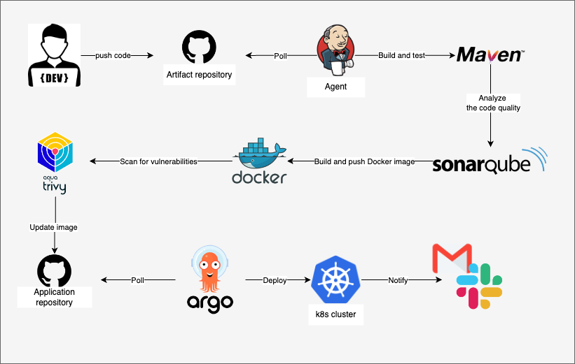

# Implementation of Robust, Scalable, and Secure CI/CD Pipelines for Enterprise Environments.

This project features a robust CI/CD process for building, testing, and deploying a Java application. It includes essential stages such as code checkout, Maven build, SonarQube analysis for code quality, Docker image creation, and security scanning with Trivy. The pipeline also manages artifact cleanup and triggers a Continuous Deployment pipeline, ensuring smooth transitions from build to deployment. Additionally, it incorporates automated email notifications for build successes and failures, keeping stakeholders informed. Overall, this project demonstrates a comprehensive approach to modern DevOps practices.

